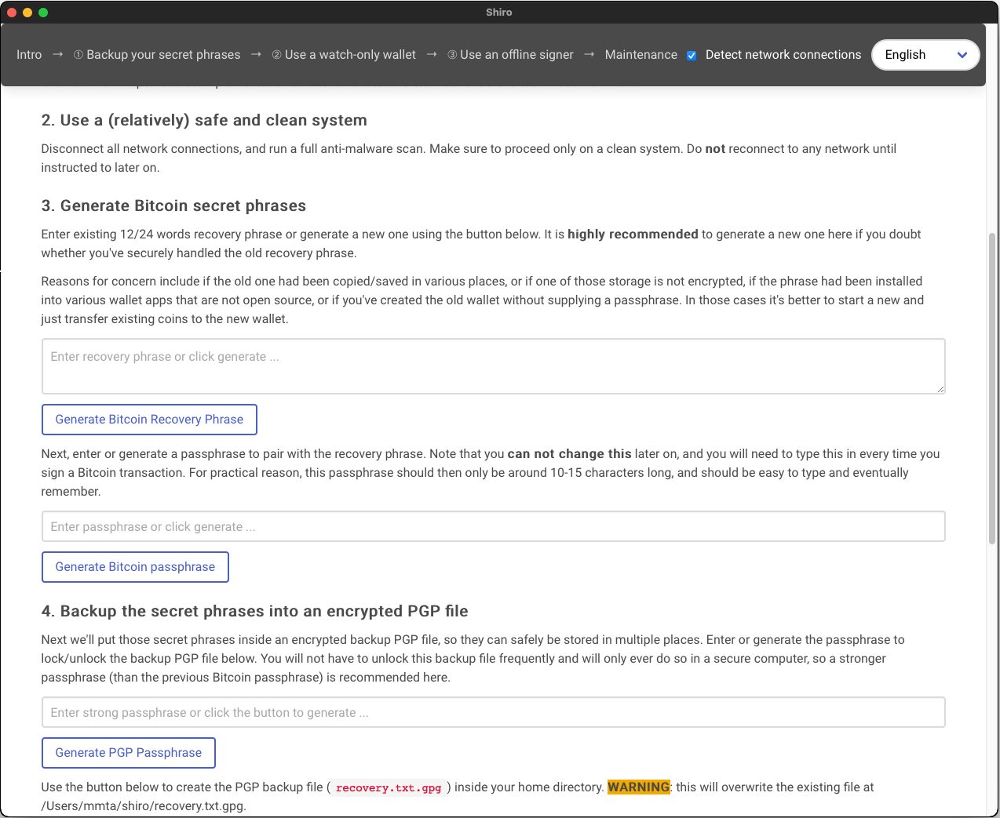

# Shiro: Secure saving in Bitcoin

[](https://github.com/mmta/shiro/actions/workflows/publish-self-hosted.yaml) [](https://codecov.io/gh/mmta/shiro) [](http://unlicense.org/)

This app provides a step-by-step guide for the average Bitcoin savers on how to securely and safely self-custody their coins.

"Securely" means preventing unauthorised access to their non-custodial wallet.

"Safely" means ensuring that the secret phrases needed to unlock or recover the wallet are always available, so people don't become [accidental donor](https://bitcointalk.org/index.php?topic=198.msg1647#msg1647) after adopting self-custody.

Example screenshot:



<!--- This section is only for those curious enough to peek ;)
## Motivation

I couldn't in good conscience recommend a safe and secure adoption path for the average non-technical person interested in Bitcoin.

The whole crypto space just have too many confusing terms, vulnerabilities and exploits, platform risks, self-custody risks, and outright scams and frauds, so I've always just said, "Stay away unless you're tech-savvy enough, have lots of time to learn, and can actively manage your position."

This app allows me now to say, "If you really want to start, buy small amount of bitcoin from <*insert a locally-regulated and currently-seems-solvent crypto exchange*>, download Shiro, and then follow the instructions in there."
-->

## Distinctive features

This app gives guidance that:
- Doesn't assume availability (or affordability) of hardware wallets, metal plates, or any crypto-specific products. The only requirements are a mobile phone, internet connectivity (doesn't have to be available for 24/7), and temporary access to a computer that's not infested by malware.

- Doesn't assume users live in locations where physical security and bank's deposit boxes are considered reliable (at least if you don't mind the [occasional raids](https://www.latimes.com/california/story/2022-09-30/judge-backs-fbi-beverly-hills-safe-deposit-box-raid)). Mnemonic phrase written on paper or steel plate is also NGMI when one has to flee the country on a dire situation, which arguably is a real risk for _majority_ of people in the world.

- Provides simple yet technically accurate explanations. Also prefers simpler security procedure over complex ones: for example secret sharing (SLIP39 and alike) is not used since 12/24 words mnemonics and a passphase may already be daunting enough for most people.

- Includes the necessary tools (like mnemonic generator or offline transaction signer) without obscuring the details too much, so that users can easily switch tools later on.

## What's inside

More specifically, this app assists users in performing these steps:

1. Creating a Bitcoin BIP39 mnemonic and passphrase (not optional).
1. Storing those secrets in an encrypted PGP file protected by a strong password.
1. Writing down the PGP password to multiple sheets of paper (and password manager software if available) without giving any hint about its purpose, then storing them in a safe location.
1. Practice opening the PGP encrypted file using GnuPG.
1. Copying the PGP file into 2 or more cloud storage providers and USB flash drives.
1. Installing a watch-only wallet (Bluewallet) in mobile phone.
1. Practice receiving coins from the users' brokerage/exchange account to Bluewallet.
1. Practice sending coins from Bluewallet back to the exchange using an offline signer/cold-wallet (this app includes [a PSBT signing function](docs/signer.png)).
1. Exploring alternative offline signers for future use (Coldcard, desktop software, or dedicated offline mobile phone).

And at the end, additional notes are given on how to maintain the setup, what kind of events will require an update, and what areas to explore further as the users' bitcoin holding grow.

## Installation

Windows, Linux, and MacOS installers are available from the [release page](https://github.com/mmta/shiro/releases/latest).

## Development & customisation

First fulfil the prerequisites for [Tauri framework](https://tauri.app/), which basically means installing Rust, Nodejs, and the tauri CLI for your OS. After that, the app can be built by cloning this repo and issuing the following commands:

```shell
npm install
npm run tauri icon src-tauri/icons/app-icon.png
npm run tauri dev
npm run tauri build
```
See the example in this github workflow if you're missing a specific system requirement: https://github.com/mmta/shiro/blob/1875044f0017a4e2a0af659e6b7c9beff13b6816/.github/workflows/publish.yaml#L44 

### Security

All secret related parts are done on the Rust side based on these libraries:

- [BDK library](https://github.com/bitcoindevkit/bdk): for most of the functions related to Bitcoin.
- [Sequoia PGP](https://gitlab.com/sequoia-pgp/sequoia): for PGP symmetric encryption/decryption.

### Translation

- Add the new locale strings into `next.config.js` (follow the existing one for `en` and `English`).
- Copy `src/locales/en` into a new folder like `src/locales/de`. Option for the new language will be available in the next run.
- Translate the text inside `src/locales/de/*.json` files. Have a look at content of the `id` directory for example.

### Testing

There's test for both Javascript and Rust code. Here's how to run both in one go:

```shell
npm run test
```
